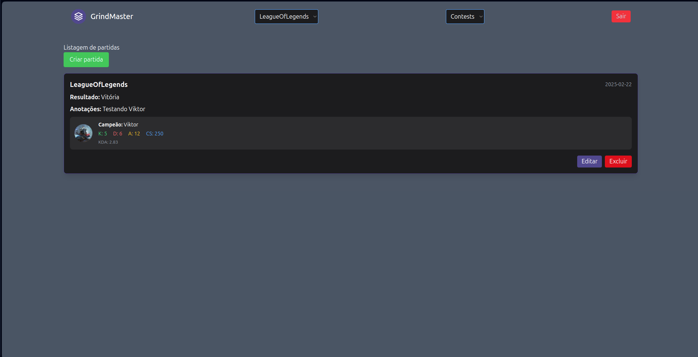

# Grind Master - Backend

## Sobre o app

Grind Master é um aplicativo desenvolvido para jogadores competitivos que desejam acompanhar sua evolução em jogos como League of Legends, Valorant, CS2, Mortal Kombat e Teamfight Tactics.

A proposta é permitir que os usuários registrem suas partidas, avaliem seu desempenho, acompanhem sua progressão em rankings e visualizem gráficos com base em seus resultados ao longo do tempo. É a ferramenta ideal para quem leva os jogos a sério e quer monitorar sua jornada rumo ao topo!

## Screenshot da aplicação


_Tela principal mostrando a listagem de partidas com estatísticas por jogo_


## Funcionalidades básicas (prioritárias):

✅ Cadastro e login de usuário  
✅ Cadastro de jogos utilizados pelo usuário  
✅ Registro de partidas com os seguintes dados:

-   Jogo
-   Data
-   Resultado (Vitória / Derrota)
-   Elo ou ranking
-   Função / Personagem jogado
-   Nota de desempenho (de 1 a 10)
-   K/D (Abates/Mortes) Em jogos que se apliquem

✅ Listagem de partidas por jogo  
✅ Cadastro de treinos  
✅ Controle de treinos feitos  

## Funcionalidades adicionais (ou futuras):

-   Estatísticas comparativas entre jogos
-   Análise de desempenho por função/personagem
-   Metas semanais de performance
-   Importação automática de dados por APIs públicas (ex: Riot API)
-   Compartilhamento de perfil com amigos
-   Notificações de metas ou lembretes de treino

## Tecnologias utilizadas

-   **Backend**: Laravel 11
-   **Frontend**: Blade Templates com Tailwind CSS
-   **Banco de dados**: SQLite
-   **Autenticação**: Laravel Auth
-   **Versionamento**: Git/GitHub

## Pré-requisitos

-   PHP 8.2+
-   Composer
-   Node.js e npm
-   SQLite

## Configuração e Execução

### 1. Clone o repositório

```bash
git clone https://github.com/yuutokolanz/GrindMasterBackend.git
cd GrindMasterBackend
```

### 2. Instale as dependências do PHP

```bash
composer install
```

### 3. Instale as dependências do Node.js

```bash
npm install
```

### 4. Configure o ambiente

```bash
cp .env.example .env
```

### 5. Gere a chave da aplicação

```bash
php artisan key:generate
```

### 6. Crie o arquivo do banco de dados SQLite
```bash
touch database/database.sqlite
```

### 7. Execute as migrações

```bash
php artisan migrate
```

### 8. Execute os seeders para dados predefinidos e/ou de teste

```bash
php artisan db:seed
```

### 9. Compile os assets

```bash
npm run build
```

### 10. Inicie o servidor

```bash
php artisan serve
```

A aplicação estará disponível em `http://localhost:8000`, utilize o usuário padrão do Laravel para realizar login. Email: test@example.com , Senha: password


## Funcionalidades implementadas

### Autenticação

-   Login e logout de usuários
-   Middleware de autenticação para rotas protegidas

### Gerenciamento de Partidas

-   Criação, edição, visualização e exclusão de partidas
-   Estatísticas específicas por jogo (Estatísticas para League of Legends e CS2 até o momento)
-   Filtro por jogo selecionado

### Gerenciamento de Treinos

-   Criação, edição, visualização e exclusão de treinos
-   Sistema de treinos repetíveis com contador de conclusões
-   Botão para marcar treino como concluído

### Interface

-   Design responsivo com Tailwind CSS
-   Componentes reutilizáveis para formulários
-   Navegação intuitiva entre diferentes seções
-   Feedback visual para ações do usuário

## Comandos úteis

```bash
# Limpar cache
php artisan cache:clear
php artisan config:clear
php artisan view:clear

# Executar migrações
php artisan migrate

# Executar seeders
php artisan db:seed

# Compilar assets em modo desenvolvimento
npm run dev